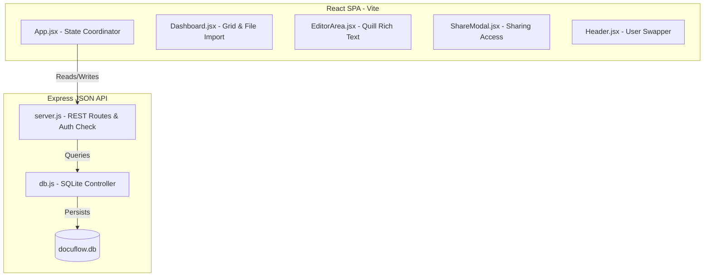

# Architecture Note: Ajaia DocuFlow

Ajaia DocuFlow is architected with a separation of concerns between a React single-page application (SPA) and an Express JSON API. This note explains the design choices, data modeling, permissions flow, and structural decisions made.

---

## 1. System Components



### Frontend Surface
- **State Coordination**: [App.jsx](file:///Users/amrit/Desktop/ajaia-docuflow/frontend/src/App.jsx) maintains the active document state, simulated user state, and document index.
- **Rich Text Editor**: [EditorArea.jsx](file:///Users/amrit/Desktop/ajaia-docuflow/frontend/src/components/EditorArea.jsx) encapsulates the Quill editor. It dynamically instantiates Quill in `readOnly` mode or interactive mode based on user permission level.
- **Aesthetic Engine**: [App.css](file:///Users/amrit/Desktop/ajaia-docuflow/frontend/src/App.css) provides the visual identity using CSS variables, custom dark colors, glassmorphic blurs, and animated state transitions.

### Backend Surface
- **HTTP Server**: [server.js](file:///Users/amrit/Desktop/ajaia-docuflow/backend/server.js) maps endpoints, handles basic validation, and implements document ownership and share checks on every document-related action.
- **Persistence Driver**: [db.js](file:///Users/amrit/Desktop/ajaia-docuflow/backend/db.js) wraps SQLite async queries and runs database seeding on load.

---

## 2. Data Modeling & Persistence

We model data in a relational format inside SQLite to enforce data consistency (e.g. cascading deletes on shares when documents are removed):

```sql
-- Core user entity (seeded on launch)
CREATE TABLE users (
  id TEXT PRIMARY KEY,
  name TEXT NOT NULL,
  email TEXT UNIQUE NOT NULL,
  avatar_color TEXT NOT NULL
);

-- Document contents
CREATE TABLE documents (
  id TEXT PRIMARY KEY,
  title TEXT NOT NULL,
  content TEXT,
  owner_id TEXT NOT NULL,
  created_at DATETIME DEFAULT CURRENT_TIMESTAMP,
  updated_at DATETIME DEFAULT CURRENT_TIMESTAMP,
  FOREIGN KEY (owner_id) REFERENCES users(id)
);

-- Access control list mapping users to document shares
CREATE TABLE shares (
  document_id TEXT NOT NULL,
  user_id TEXT NOT NULL,
  permission TEXT NOT NULL CHECK(permission IN ('view', 'edit')),
  PRIMARY KEY (document_id, user_id),
  FOREIGN KEY (document_id) REFERENCES documents(id) ON DELETE CASCADE,
  FOREIGN KEY (user_id) REFERENCES users(id)
);
```

---

## 3. Access Control System (Authorization)

Instead of complex JWT tokens or real-world session cookie verification, we pass the simulated user's identifier (`userId`) via headers/query parameters. The backend performs validation on every request:
1. **Owner Access**: If the document's `owner_id` matches the requesting `userId`, access is granted with `'owner'` permission. The owner can Read, Edit, Share, and Delete the document.
2. **Shared Access**: If a record exists in the `shares` table for the `document_id` and requesting `user_id`, access is granted with the mapped permission (`'edit'` or `'view'`).
   - Editors can read and modify content.
   - Viewers can only read content (Quill editing functions are locked).
3. **No Access**: If neither check passes, a `403 Forbidden` response is returned.

---

## 4. Key Engineering Decisions & Trade-offs

### ⏱️ Debounced Auto-Saving
We chose to implement client-side debouncing (1000ms delay) on both title changes and text editing inside the Quill instance. This drastically limits API write load while preserving the "autosaving to cloud" feel of Google Docs.

### 🔌 In-Browser File Parsing (Import)
For file uploads, the client uses the HTML5 File Reader API to parse `.txt` and `.md` uploads directly in the user's browser, transmitting the raw text payload to the backend document creation endpoint. This simplified the architecture by eliminating multipart form-data parsing libraries, file upload storage buckets, and temporary server-side storage cleanups.

### 🚪 Simulated User Dropdown
We chose to skip implementing authentication (OAuth / passwords) to keep the project scoped and focus maximum attention on document creation, sharing mechanics, custom dark aesthetics, and test suites. The simulated dropdown lets reviewers immediately experience both sides of the sharing interface without requiring registration.
